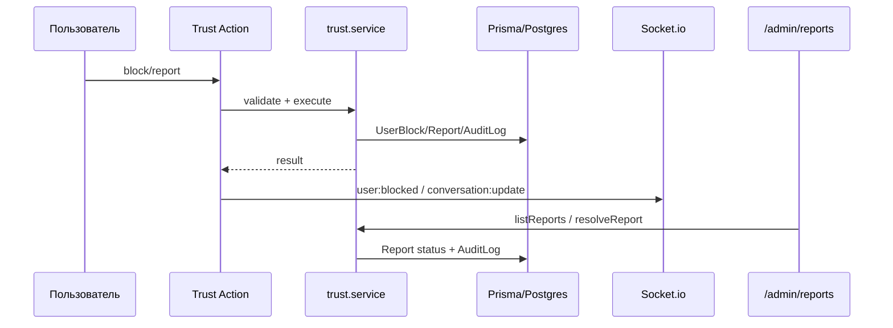

# Orchestrator Summary — Trust/Safety MVP

**Дата:** 2026-04-29  
**Режим:** `/delegate`  
**Участники:** Orchestrator, Security, Code Quality, QA, Notary, Explorer subagents  
**Security verdict:** `PASS_WITH_NOTES`

## Executive Summary

Выполнен MVP Trust/Safety из `docs/trust_system_implementation_plan.md`: личные блокировки пользователей в чате, универсальные жалобы, evidence snapshot без plaintext и минимальная админ-очередь `/admin/reports`.

Ключевое архитектурное решение: личный `UserBlock` не смешивается с существующим `User.chatBlockedAt`. `chatBlockedAt` остается глобальной админской блокировкой чата, а `UserBlock` отвечает за пользовательские блокировки между двумя аккаунтами.

## Technical Diff

- `apps/web/prisma/schema.prisma` + `20260429181417_add_trust_safety`: `UserBlock`, `Report`, enum-ы жалоб и связи в `User`.
- `apps/web/src/services/trust.service.ts`: блокировка, разблокировка, block state, server-side enforcement, админское решение жалоб.
- `apps/web/src/services/trust-evidence.ts`: сбор evidence последних 10 сообщений без расшифрованного текста.
- `apps/web/src/features/trust/*`: Server Actions, Zod-схемы, `ReportModal`, `BlockUserButton`, `BlockedState`, `ReportModerationActions`.
- `chat.service.ts`: `startConversation` и `sendMessage` теперь проверяют Trust/Safety.
- UI чата: действия жалобы/блокировки в header, жалоба на сообщение, blocked state вместо поля ввода.
- `/admin/reports`: фильтры, карточки жалоб, evidence summary, действия модерации.

## Flow

## Security Notes

- Server Actions используют `authActionClient` / `adminActionClient`.
- Жалобы rate-limited: 5 жалоб в час на пользователя.
- Evidence не содержит plaintext сообщений; хранится encrypted text + SHA-256 hash + метаданные.
- `sendMessage` защищен на DAL-уровне, поэтому UI bypass не дает отправить сообщение.
- Socket event `user:blocked` теперь типизирован payload-ом.

## Verification

| Проверка | Результат |
|---|---|
| `npx tsc --noEmit` | PASS |
| `npm run test -- --run` | PASS, 4 файла / 19 тестов |
| Service tests | PASS, chat + trust |
| HTTP-smoke `/admin/reports` без auth | PASS, `307 -> /auth/login?callbackUrl=%2Fadmin%2Freports` |
| Playwright Chromium | BLOCKED: escalation отклонен авто-ревью из-за лимита доступа |

## Остаточные задачи

- Добавить полноценные E2E с авторизованными фикстурами: "A блокирует B -> B не может написать" и "жалоба появляется в `/admin/reports`".
- Расширить точки жалоб на заказы, объявления, отзывы и профили.
- Реализовать 11.5.4.6: MVP-детект контактов в чате.
